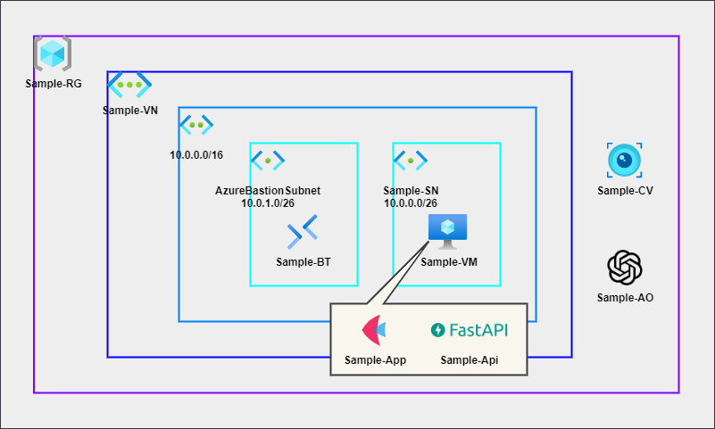
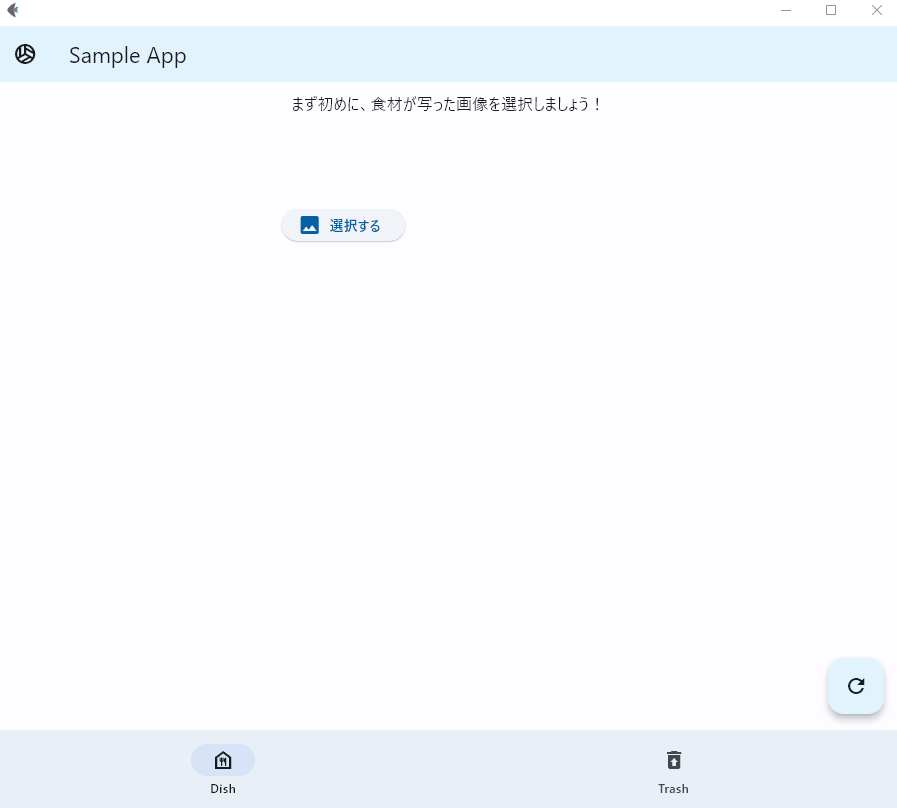

= Sample
:toc:

== Introduction
これはサンプルドキュメントです

== Main Contents
=== Architecture
* アーキテクチャは以下を想定

=== Preparation for Azure
==== Resourece List
* Azureで作成するリソースは以下を想定

[cols="1,1,3", options="header"]
|===
|Name|Type, Kind|Memo, Config

|Sample-RG|Resource Groups|
・作成順序は1位 +
・作成不要？

|Sapmle-VN|Virtual Networks|
・作成順序は2位 +
・アドレス空間はデフォルトで作成 +
・サブネットはデフォルトで作成し、後で削除

|AzureBastionSubnet|Subnets|
・作成順序は3位 +
・CIDRは10.0.1.0/26

|Sample-SN|Subnets|
・作成順序は4位 +
・CIDRは10.0.0.0/26 +
・サービスはMicrosoft.CognitiveServices

|Sample-VM|Virtual Machines|
・作成順序は5位 +
・イメージはWindows（要相談） +
・サイズはB4ms（要相談） +
・ストレージはHDD +
・パブリックIPは無し +
・ネットワークはSample-VN/Sample-SN +
・User/PassはSample-Admin/Sample@Admin +
・作成後にロックで削除ロックを作成

|Sample-BT|Bastion Hosts|
・Sample-VMアクセス時に作成 +
・レベルはBasic +
・ネットワークはSample-VN/AzureBastionSubnet +
・IPは新規作成（Sample-IP）

|Sample-IP|Public IP Addresses|
・Sample-BTの作成過程で作成

|Sample-CV|Computer Vision|
・作成順序は6位 +
・価格レベルはFree +
・ネットワークはSample-VN/Sample-SN

|Sample-AO|Azure OpenAI|
・略

|===

=== Preparation for DevEnv
==== VSCode +
* DL先： https://code.visualstudio.com/
* 拡張機能： Python extension for Visual Studio Code
* デスクトップにアイコンを作成

==== Python
* DL先： https://www.python.org/downloads/
* ランタイムに含める
* CMDで``pip install flet fastapi uvicorn requests``を実行

=== Notes on work
* Azure使用時のコマンド
** 作業終了時
*** サブスクリプション指定 +
``Set-AzContext -SubscriptionId <YOUR_SUBSCRIPTION_NAME>``
*** Azure Bastion削除 +
``Remove-AzBastion -Name <YOUR_BASTION_NAME> -ResourceGroupName <YOUR_RESOURCE_GROUP> -Force``
*** パブリックIP削除 +
``Remove-AzPublicIpAddress -Name <YOUR_IP_NAME> -ResourceGroupName <YOUR_RESOURCE_GROUP> -Force``

== Bonus
